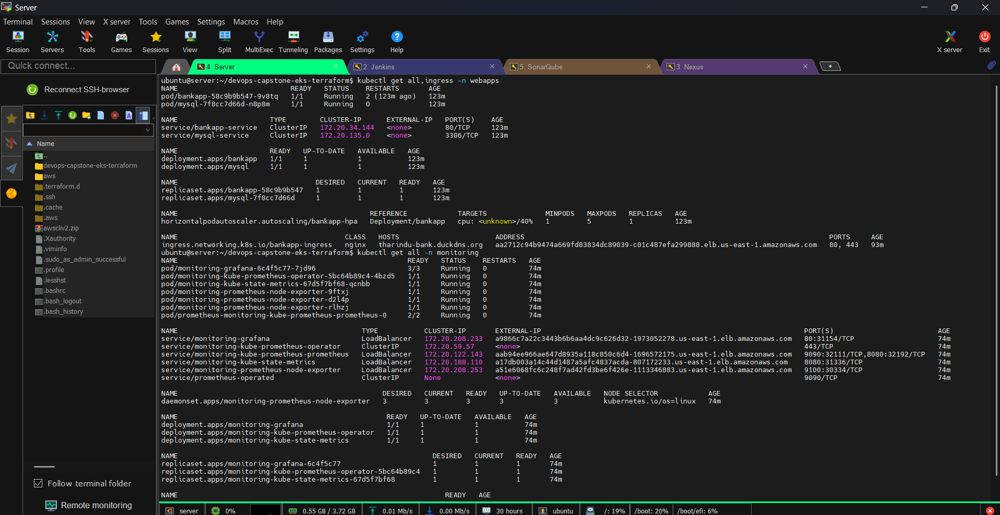

# Phase 4: Continuous Deployment (CD) and GitOps

The Continuous Deployment phase represents the final leg of the automation pipeline. Instead of pushing updates directly from the CI build server to the production cluster, this project utilizes GitOps principles. The cluster state is entirely dictated by the configuration stored in the CD GitHub repository (`devops-capstone-k8s-manifests`).

## The Deployment Architecture

Here is the exact workflow of how the application rolls out to the Amazon EKS cluster:

* **Automated Trigger:** The Continuous Deployment pipeline automatically triggers immediately following the automated Git commit generated at the end of the CI phase (which updated the image tag to the latest build, e.g., `tmdeshapriya/bankapp:v15`).
* **Secure Authentication:** Jenkins authenticates to the EKS control plane. Instead of using root AWS credentials, it assumes the highly restricted `jenkins` ServiceAccount token (configured via RBAC in Phase 3) to ensure it can only operate within its authorized bounds.
* **Manifest Application:** The revised deployment manifests are applied to the `webapps` namespace. This includes:
    * **Deployments & Services:** For the Java Spring Boot Bank Application.
    * **Stateful Components:** Persistent Volume Claims (PVCs) for the MySQL database, which dynamically provision AWS EBS volumes via the EBS CSI Driver.
    * **Autoscaling:** The Horizontal Pod Autoscaler (HPA) configuration.
* **Zero-Downtime Rolling Update:** Kubernetes detects the change in the deployment's image tag and orchestrates a rolling update. It spins up the new application pods, waits for them to pass their readiness probes, and then gracefully terminates the old pods, ensuring zero-downtime deployment for the end users.


## Step 1: Pre-requisite - Install `kubectl` on Jenkins Server

**Target Server:** Jenkins EC2 Instance (via SSH)

Because Jenkins will be running `kubectl apply` commands in its pipeline, the `kubectl` CLI tool must be installed directly on the Jenkins EC2 instance.

Run this on your Jenkins Server:

```bash
curl -LO "https://dl.k8s.io/release/$(curl -L -s https://dl.k8s.io/release/stable.txt)/bin/linux/amd64/kubectl"
sudo install -o root -g root -m 0755 kubectl /usr/local/bin/kubectl
kubectl version --client
```

## Step 2: Start the CD Pipeline Configuration in Jenkins

**Target Environment:** Jenkins Web Dashboard (Browser)

### Create a New Pipeline Job in Jenkins:
1. Open the Jenkins dashboard → **Create a new item** → Choose **Pipeline**.
2. Name it (e.g., `Capstone-CD-Pipeline`).

### Define the Pipeline Script:
Scroll down to the **Pipeline** section and paste the following Jenkinsfile.

> **Note on Server URL:** You must get your exact API Server Endpoint URL from the AWS Console (**AWS Console > EKS Cluster > Copy the API Server Endpoint URL**).

```groovy
pipeline {
    agent any

    stages {
        stage('Git Checkout (Clone CD Repository)') {
            steps {
                // Pulls the newly updated manifests from the GitOps CD repository
                git branch: 'main', credentialsId: 'github-cred', url: 'https://github.com/tharindudeshapriya/devops-capstone-k8s-manifests.git'
            }  
        }

        stage('Deploy to Kubernetes') {
            steps {
                // Authenticate using the restricted RBAC token
                withKubeConfig(
                    credentialsId: 'k8s-token', 
                    clusterName: 'capstone-devops-cluster',
                    namespace: 'webapps',
                    restrictKubeConfigAccess: false,
                    // Replace with your actual EKS API Server Endpoint URL
                    serverUrl: 'https://D133D06C5103AE18A950F2047A8EB7DE.gr7.us-east-1.eks.amazonaws.com'
                ) {
                    // Apply the core application and database manifests
                    sh 'kubectl apply -f k8s-manifest-files/Manifest.yaml -n webapps'
                    
                    // Apply the Horizontal Pod Autoscaler
                    sh 'kubectl apply -f kubernetes/HPA.yaml'
                    
                    // Allow pods a moment to begin initialization
                    sleep 30
                    
                    // Output the rollout status to the Jenkins console logs for auditing
                    sh 'kubectl get pods -n webapps'
                    sh 'kubectl get svc -n webapps'
                }
            }  
        }
    }
}
```

## Step 3: Verify Kubernetes Resources Creation

**Target Server:** Bootstrap / Management Server (via SSH)

Once the pipeline runs successfully, you should verify that Kubernetes has created all the necessary resources (Pods, Services, Persistent Volumes, and Storage Classes).

Run these commands from your Bootstrap Server:

```bash
kubectl get all -n webapps
kubectl get pv
kubectl get sc
```

## Step 4: Setup ClusterIssuer and Ingress (SSL & DNS)

**Target Server:** Bootstrap / Management Server (via SSH)

For security and routing, we will set up the Let's Encrypt ClusterIssuer and the NGINX Ingress rules to route external traffic to your `tharindu-bank.duckdns.org` domain.

We will create and apply these files directly from the Bootstrap Server.

### 1. The ClusterIssuer (`ci.yaml`)

Create a file named `ci.yaml`. This tells Cert-Manager how to communicate with Let's Encrypt using your email.

```yaml
apiVersion: cert-manager.io/v1
kind: ClusterIssuer
metadata:
  name: letsencrypt-prod
spec:
  acme:
    server: https://acme-v02.api.letsencrypt.org/directory
    email: tmdeshapriya@gmail.com
    privateKeySecretRef:
      name: letsencrypt-prod
    solvers:
    - http01:
        ingress:
          class: nginx
```

### 2. The Ingress Route (`ing.yaml`)

Create a file named `ing.yaml`. This handles the routing and enforces HTTPS redirection for your specific DuckDNS domain.

```yaml
apiVersion: networking.k8s.io/v1
kind: Ingress
metadata:
  name: bankapp-ingress
  namespace: webapps
  annotations:
    nginx.ingress.kubernetes.io/rewrite-target: /
    nginx.ingress.kubernetes.io/force-ssl-redirect: "true"
    nginx.ingress.kubernetes.io/ssl-redirect: "true"
    cert-manager.io/cluster-issuer: letsencrypt-prod
spec:
  ingressClassName: nginx
  tls:
  - hosts:
    # CHANGE THIS ONLY IF YOU BOUGHT A REAL DOMAIN
    - tharindu-bank.duckdns.org
    secretName: bankapp-tls-secret
  rules:
  # CHANGE THIS ONLY IF YOU BOUGHT A REAL DOMAIN
  - host: tharindu-bank.duckdns.org
    http:
      paths:
      - path: /
        pathType: Prefix
        backend:
          service:
            name: bankapp-service
            port:
              number: 80
```

### 3. Apply and Check the Status

Apply both files to the cluster (from the Bootstrap Server):

```bash
kubectl apply -f ci.yaml
kubectl apply -f ing.yaml
```

Check the status to ensure the AWS Load Balancer was assigned to your Ingress:

```bash
kubectl get ing -n webapps
```



### 4. Link AWS Load Balancer to DuckDNS

**Target Environment:** Terminal & DuckDNS Dashboard

DuckDNS requires an IP address to route traffic, but AWS Ingress provisions a Load Balancer with a DNS URL (e.g., `a1b2c3d...elb.us-east-1.amazonaws.com`). Here is how to link them:

1. **Get the Load Balancer URL:** Look at the `ADDRESS` column from the `kubectl get ing` command you ran above and copy the long AWS URL.
2. **Extract the IP Address:** In your terminal, use the `ping` (or `nslookup`) command on that URL to find its underlying IP address:
   ```bash
   ping <your-aws-load-balancer-url>
   ```
   
   

   *(Copy the IP address that responds, for example: `34.205.12.99`).*
3. **Update DuckDNS:**
   * Log into your DuckDNS Dashboard.
   * Find your registered domain (`tharindu-bank`).
   * Paste the IP address you just grabbed into the "current ip" box.
   * Click **Update IP**.

*(Wait 2-5 minutes for the DNS changes to propagate. Your application will then be live at `https://tharindu-bank.duckdns.org` and Cert-Manager will automatically verify the domain and issue your HTTPS padlock!)*

## How to Automate the CI/CD Hand-off

**Target Environment:** Jenkins Web Dashboard (Browser)

To make this a true "Mega Pipeline" where CI and CD are decoupled but fully automated, the CD pipeline is configured to listen for the CI pipeline's completion:

1. Open your CI Pipeline configuration in the Jenkins UI.
2. Scroll down to the **Post-build Actions** section.
3. Select **Build other projects**.
4. Enter the name of your CD job (e.g., `Capstone-CD-Pipeline`).
5. Select **Trigger only if build is stable**.

With this in place, a developer pushing code to the application repository sets off a chain reaction that compiles the code, scans for vulnerabilities, pushes to DockerHub, updates the GitOps repository, and finally rolls out the changes live to the AWS EKS cluster—all with 100% automation.


---
[⬅️ Back to Main README](../README.md)
