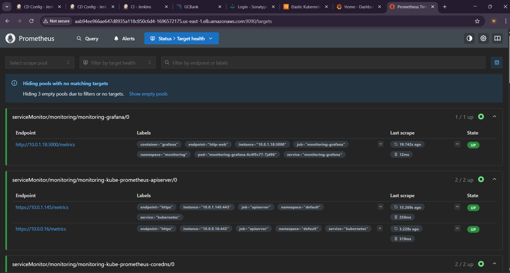

# Phase 5: Observability, Monitoring, and Autoscaling

To ensure the reliability and performance of the banking application in a production environment, this phase introduces a comprehensive observability stack and automated scaling mechanisms.

## Part 1: Telemetry and Visualization (Prometheus & Grafana)

We deploy the `kube-prometheus-stack` via Helm to aggregate cluster metrics. A customized `values.yaml` configuration is implemented to securely expose the Grafana dashboard and capture system-level metrics utilizing `node-exporter` and `kube-state-metrics`.

### 1. Create the Custom `values.yaml`

**Target Server:** Bootstrap / Management Server (via SSH)

We'll define how Prometheus and Grafana should be deployed, what metrics to scrape, and how to expose the services. This configuration also automatically provisions persistent EBS storage for Prometheus and pre-configures Grafana administrative access.

Create a file called `values.yaml`:

```bash
vi values.yaml
```

Paste the following configuration:

```yaml
# values.yaml for kube-prometheus-stack
alertmanager:
  enabled: false
prometheus:
  prometheusSpec:
    service:
      type: LoadBalancer
    storageSpec:
      volumeClaimTemplate:
        spec:
          storageClassName: ebs-sc  # Custom StorageClass for AWS EBS
          accessModes:
            - ReadWriteOnce
          resources:
            requests:
              storage: 5Gi
  additionalScrapeConfigs:
    - job_name: node-exporter
      static_configs:
        - targets:
            - node-exporter:9100
    - job_name: kube-state-metrics
      static_configs:
        - targets:
            - kube-state-metrics:8080
grafana:
  enabled: true
  service:
    type: LoadBalancer
  adminUser: admin
  adminPassword: admin123
prometheus-node-exporter:
  service:
    type: LoadBalancer
kube-state-metrics:
  enabled: true
  service:
    type: LoadBalancer
```

Save and exit the file.

*(As seen above, we have already generated the username and password for Grafana directly within this `values.yaml` file).*

### 2. Install Monitoring Stack with Helm

With the values configured, add the Prometheus community repository and install the stack into a dedicated `monitoring` namespace.

```bash
# Add the Helm repository
helm repo add prometheus-community https://prometheus-community.github.io/helm-charts
helm repo update

# Install the stack using the custom values file
helm upgrade --install monitoring prometheus-community/kube-prometheus-stack -f values.yaml -n monitoring --create-namespace
```

### 3. Patch Services to Use LoadBalancer

While the URL for Grafana is often exposed correctly, we can use patch commands to ensure Prometheus and other metrics servers also receive an AWS Load Balancer.

*(This step ensures all services are properly exposed if the `values.yaml` didn't fully propagate the Service type).*

```bash
kubectl patch svc monitoring-kube-prometheus-prometheus -n monitoring -p '{"spec": {"type": "LoadBalancer"}}'
kubectl patch svc monitoring-kube-state-metrics -n monitoring -p '{"spec": {"type": "LoadBalancer"}}'
kubectl patch svc monitoring-prometheus-node-exporter -n monitoring -p '{"spec": {"type": "LoadBalancer"}}'
```

### 4. Access Grafana and Prometheus

**Get LoadBalancer IPs/URLs:**
Wait a few minutes for AWS to provision the load balancers, then retrieve the URLs:

```bash
kubectl get svc -n monitoring
```

Look for the `EXTERNAL-IP` column for your Grafana and Prometheus services.

**Access Grafana:**
* **URL:** `http://<grafana-loadbalancer-ip>`
* **Login:** `admin` / `admin123`


**Add Prometheus Data Source in Grafana:**
1. In Grafana, go to **Connections -> Data Sources -> Add data source**.
2. Select **Prometheus**.
3. **Data source URL:** `http://<prometheus-loadbalancer-ip>:9090`
4. Click **Save & Test**.



**Use Prebuilt Dashboards:**
Many comprehensive dashboards come pre-installed with the Helm chart. Navigate to the **Dashboards** menu in Grafana to view immediate insights into your EKS cluster's CPU, Memory, and Network usage.


## Part 2: Load Simulation & Validation

To prove the autoscaling architecture works, we performed a traffic simulation against the live environment.

### 1. Load Testing Automation

**Target Server:** Bootstrap / Management Server (via SSH)

We launched an ephemeral `httpd:alpine` pod to execute an Apache Benchmark (`ab`) stress test. This command simulates 100 concurrent users sending a total of 500,000 HTTP requests to the internal Kubernetes service routing to the Bank Application.

```bash
kubectl run apache-bench --image=httpd:alpine --rm -it -- ab -n 500000 -c 100 http://bankapp-service.webapps.svc.cluster.local/login
```

*(While this is running, you can monitor the scaling in a separate terminal by running `kubectl get hpa -n webapps -w`).*

### 2. Validation Result

* **Detection:** The Kubernetes Metrics Server successfully detected the artificial load, observing the application's CPU utilization spike well past the 40% threshold.
* **Scale-Up:** The HPA seamlessly intercepted this metric and orchestrated the deployment to scale from a single pod to five parallel instances to distribute the incoming traffic.
* **Scale-Down:** Upon completion of the stress test (when the concurrent requests ceased), the cluster entered a cool-down phase and gracefully scaled down to the baseline replica count (1 pod) to optimize AWS resource consumption.

*(Visual confirmation of this event is available in the Grafana Compute Resources / Namespace (Workloads) dashboard, showing both the CPU spike and the replica count step-up).*
